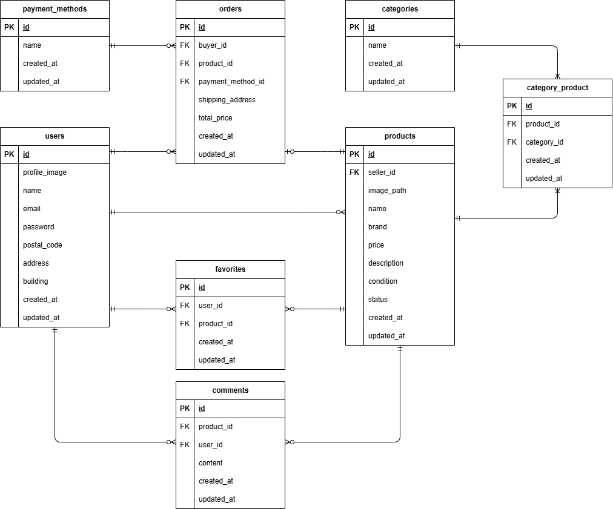

# アプリケーション名

coachtechフリマ

## 環境構築

### 1. Docker コンテナのビルド・起動

```bash
docker compose up -d --build
```

### 2. PHP コンテナに入って依存関係をインストール

```bash
docker compose exec php bash
composer install
cp .env.example .env
php artisan key:generate
```

### 3. マイグレーション実行

```bash
docker compose exec php php artisan migrate
```

### 4. シーディング実行

```bash
docker compose exec php php artisan db:seed
```

## 使用技術（実行環境）

- PHP 8.x
- Laravel 8.x
- MySQL 8.x
- Nginx
- Docker / docker-compose

## ER 図



## URL

- 開発環境：http://localhost/

## ログインアカウント

### テスト用ユーザー（購入者）

- **name**: テストユーザー
- **email**: test@example.com
- **password**: password

### 出品者ユーザー

- **name**: 出品者A
- **email**: seller@example.com
- **password**: password

## 画像について

サンプル画像を `storage/app/public/products/` に含めています。
初回は以下のコマンドでシンボリックリンクを作成してください。

```bash
php artisan storage:link
```

## メール送信の確認方法

本プロジェクトでは MailHog を使用しています。
`docker compose up -d` で MailHog コンテナも起動します。
ブラウザで http://localhost:8025 にアクセスするとメールを確認できます。
また、`認証はこちらから` ボタンで MailHog を開くために `.env` に以下を設定してください。

```env
MAIL_CLIENT_URL=http://localhost:8025
```

## Stripe決済について

本アプリではStripeを利用して決済を行います。
動作確認にはStripeのテスト用APIキーが必要です。

1. Stripeのアカウントを作成してください
2. ダッシュボードから **開発者 → API キー** を開き、以下を取得してください
    - 公開可能キー（例: pk_test_xxx）
    - シークレットキー（例: sk_test_xxx）
3. `.env` に設定してください（`.env.example` をコピーして編集）
    ```env
    STRIPE_KEY=pk_test_xxx
    STRIPE_SECRET=sk_test_xxx
    ```
4. テストカード番号（例: `4242 4242 4242 4242`）で決済確認できます
